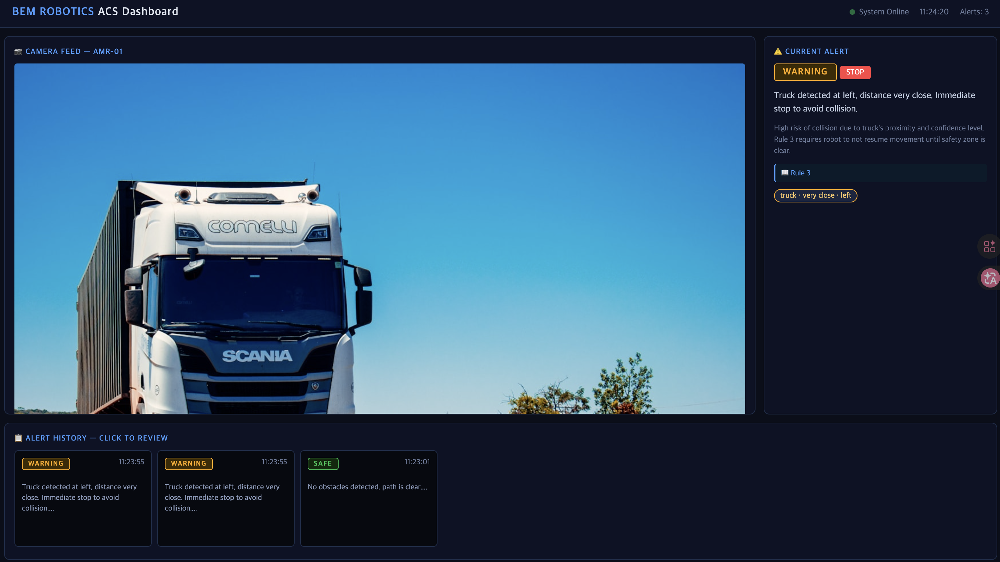
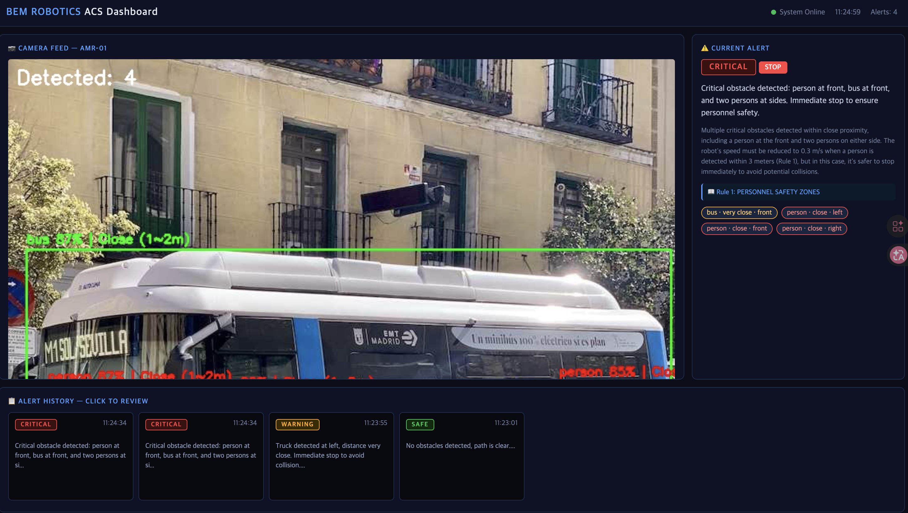

# AMR Safety AI

AMR/AGV 카메라 영상에서 장애물을 실시간 감지하고, LLM이 물류 안전 규정을 참조해
위험도를 자율 판단한 뒤 관제 대시보드에 경고를 생성하는 end-to-end AI 파이프라인

---

## 프로젝트 개요

물류 현장에서 AMR/AGV는 사람, 차량, 장애물과 같은 공간을 공유하며 주행합니다.
기존 시스템은 단순 센서 기반으로 장애물을 감지하는 데 그쳤지만,
이 프로젝트는 카메라 영상 기반 딥러닝 객체 인식과 LLM의 자연어 판단을 결합해
상황에 맞는 대응 지시를 자동으로 생성하는 구조를 구현했습니다.

벰로보틱스의 PCS(위치·제어)와 ACS(관제) 제품 구조를 분석하고,
실제 물류 로봇 관제 시스템의 AI화 방향을 직접 설계하고 구현했습니다.

---

## 제품 구조 반영

| 이 프로젝트                        | 벰로보틱스 제품                          |
|------------------------------------|------------------------------------------|
| YOLOv8 객체 인식 + 거리 추정       | PCS (위치·제어 솔루션) 인식 레이어       |
| LLM + RAG 기반 상황 판단           | ACS (관제 솔루션) AI화 방향              |
| FastAPI + WebSocket 관제 대시보드  | ACS 관제 화면 구조                       |
| 온프레미스 Ollama 로컬 LLM         | 공장 내 인터넷 단절 환경 대응            |

---

## 시스템 아키텍처

    카메라/이미지 입력
           |
           v
    [detector.py] YOLOv8n 객체 감지
    - person, truck, car, bus 등 물류 관련 클래스 필터링
    - Apple Silicon MPS 가속
    - 바운딩박스 크기 기반 상대 거리 추정
           |
           v
    [context_parser.py] 감지 결과 -> 구조화된 컨텍스트
    - 객체별 위치(front/left/right) 및 거리(very_close/close/mid/far) 분류
    - 클래스별 위험 가중치 적용 risk_score 계산
    - SAFE / CAUTION / WARNING / CRITICAL 4단계 위험도 산출
           |
           v
    [rag_pipeline.py] ChromaDB 벡터 검색
    - 물류 안전 규정 문서 청크 분할 후 임베딩 저장
    - 감지 상황과 관련된 규정 similarity search
    - LLM 프롬프트에 관련 규정 컨텍스트 삽입
           |
           v
    [llm_client.py] LLM 판단
    - Ollama llama3.2:3b (로컬 온프레미스)
    - OpenAI gpt-4o-mini (멀티 LLM 추상화)
    - 위험도 / 권장조치 / 경고메시지 JSON 출력
           |
           v
    [main.py] FastAPI + WebSocket
    - REST API 이미지 분석 엔드포인트
    - WebSocket 실시간 대시보드 푸시
    - ACS 스타일 관제 대시보드

---

## 설계 결정 이유

### 1. 왜 LLM을 관제 판단에 사용했는가

단순 규칙 기반(if-else) 시스템은 사전에 정의된 조건만 처리할 수 있습니다.
반면 물류 현장은 다양한 변수가 복합적으로 발생합니다.
예를 들어 "사람 1명 + 트럭 1대가 동시에 전방 근거리에 감지된 경우"처럼
복합 상황에서 규칙 기반은 조건이 폭발적으로 늘어납니다.

LLM은 자연어로 표현된 상황 컨텍스트를 이해하고
복합 조건에서도 안전 규정을 참조해 일관된 판단을 내릴 수 있습니다.
또한 경고 메시지를 자연어로 생성하기 때문에
관제 담당자가 상황을 직관적으로 파악할 수 있습니다.

### 2. 왜 RAG를 적용했는가

LLM은 학습 데이터 기반으로 일반적인 판단을 내리지만,
기업 내부의 구체적인 안전 규정(예: 특정 구역 속도 제한, 작업자 안전구역 반경 등)은
학습되어 있지 않습니다.

RAG를 통해 물류 안전 규정 문서를 벡터 DB에 저장하고
상황에 맞는 규정을 실시간으로 검색해 LLM 프롬프트에 삽입함으로써
기업 규정 기반의 정확한 판단이 가능하도록 설계했습니다.

### 3. 왜 온프레미스 LLM(Ollama)을 선택했는가

물류 공장 내부 네트워크는 보안상 외부 인터넷 접속이 제한되는 경우가 많습니다.
OpenAI API 같은 클라우드 LLM은 인터넷 연결이 필수적이기 때문에
실제 공장 환경에서는 사용이 불가능할 수 있습니다.

Ollama 기반 로컬 LLM은 인터넷 없이 온프레미스에서 완전히 동작하며,
LLMClient 클래스를 추상화 레이어로 설계해
provider 파라미터 하나로 Ollama와 OpenAI를 즉시 전환할 수 있도록 구현했습니다.

---

## 트러블슈팅

### 1. LLM JSON 파싱 실패 — 응답 포맷 불일치 문제

문제 상황

llama3.2 모델이 JSON을 반환할 때 순수 JSON이 아닌
마크다운 코드블록으로 감싸서 응답하는 경우가 발생했습니다.

```json
    {
        "risk_level": "CRITICAL",
        ...
    }
```

이 경우 json.loads()가 백틱과 json 키워드를 파싱하지 못해
JSONDecodeError가 발생했고, 분석 결과가 전달되지 않았습니다.

원인 분석

LLM은 기본적으로 사람이 읽기 좋은 형태로 응답하도록 훈련되어 있습니다.
시스템 프롬프트에서 JSON 형식을 요구해도
모델에 따라 마크다운 포맷을 함께 사용하는 경향이 있습니다.
특히 temperature가 높을수록 이런 현상이 더 자주 발생합니다.

해결 방법

단순히 json.loads()만 호출하는 대신
응답에 백틱이 포함되어 있는지 먼저 확인하고
코드블록을 제거한 뒤 파싱하는 방어 로직을 추가했습니다.

    def _parse_json(self, raw: str) -> dict:
        raw = raw.strip()
        if "```" in raw:
            raw = raw.split("```")[1]
            if raw.startswith("json"):
                raw = raw[4:]
        try:
            return json.loads(raw.strip())
        except json.JSONDecodeError:
            return self._fallback_response(raw)

또한 temperature를 0.1로 낮춰 응답의 일관성을 높였습니다.
낮은 temperature는 모델이 더 결정론적으로 동작하게 해
JSON 형식을 더 안정적으로 유지하게 합니다.

---

### 2. 임베딩 모델 교체 시 ChromaDB 벡터 호환성 문제

문제 상황

시스템 성능 최적화를 위해 임베딩 모델을 llama3.1에서 llama3.2:3b로 교체했을 때
기존에 저장된 ChromaDB 벡터와 새 모델의 임베딩 차원이 달라
RAG 검색 시 다음과 같은 에러가 발생했습니다.

    chromadb.errors.InvalidDimensionException:
    Embedding dimension 4096 does not match collection dimensionality 3072

원인 분석

ChromaDB는 컬렉션 생성 시점의 임베딩 차원을 고정합니다.
llama3.1은 4096차원, llama3.2:3b는 3072차원의 임베딩을 생성하기 때문에
모델을 교체하면 기존 벡터 DB와 차원이 맞지 않아 검색 자체가 불가능해집니다.

이는 단순한 설정 문제가 아니라
벡터 DB의 구조적 특성에서 비롯된 문제입니다.

해결 방법

임베딩 모델이 교체될 때는 반드시 기존 벡터 DB를 삭제하고
새 모델로 전체 문서를 재임베딩해야 합니다.

    rm -rf data/chroma_db

이를 방지하기 위해 RAGPipeline 초기화 시
현재 임베딩 모델명을 메타데이터로 저장하고
모델이 변경되었을 때 자동으로 재생성하는 구조로 개선할 수 있습니다.
현재는 모델 교체 시 수동으로 DB를 재생성하는 방식으로 운영합니다.

---

### 3. LangChain 버전 업데이트로 인한 모듈 경로 변경 문제

문제 상황

프로젝트 초기 설치 시 최신 버전의 LangChain을 설치했는데
기존에 널리 사용되던 import 경로가 더 이상 동작하지 않았습니다.

    from langchain.text_splitter import RecursiveCharacterTextSplitter
    # ModuleNotFoundError: No module named 'langchain.text_splitter'

    from langchain_community.embeddings import OllamaEmbeddings
    # LangChainDeprecationWarning: will be removed in 1.0.0

원인 분석

LangChain은 0.2.x 버전부터 모놀리식 구조에서
기능별 독립 패키지로 분리하는 방향으로 아키텍처를 전환했습니다.
text_splitter는 langchain-text-splitters 패키지로,
OllamaEmbeddings는 langchain-ollama 패키지로,
Chroma는 langchain-chroma 패키지로 각각 분리되었습니다.

대규모 오픈소스 라이브러리에서 자주 발생하는 breaking change 유형으로
공식 migration guide를 참조해 경로를 수정해야 합니다.

해결 방법

분리된 패키지를 별도로 설치하고 import 경로를 수정했습니다.

    pip install langchain-text-splitters langchain-ollama langchain-chroma

    # 변경 전
    from langchain.text_splitter import RecursiveCharacterTextSplitter
    from langchain_community.embeddings import OllamaEmbeddings
    from langchain_community.vectorstores import Chroma

    # 변경 후
    from langchain_text_splitters import RecursiveCharacterTextSplitter
    from langchain_ollama import OllamaEmbeddings
    from langchain_chroma import Chroma

---

## 데모 스크린샷

SAFE — 장애물 없음, 정상 주행


WARNING — 차량 감지, 감속 및 주의


CRITICAL — 사람+차량 동시 감지, 즉시 정지


---

## 실행 방법

1. 사전 요구사항
   - Python 3.11+
   - Ollama 설치 (https://ollama.ai)
   - Apple Silicon (MPS) 또는 CUDA GPU 권장

2. 설치

       git clone https://github.com/daeqode/Amr-safety-ai.git
       cd Amr-safety-ai
       python -m venv venv
       source venv/bin/activate
       pip install -r requirements.txt

3. Ollama 모델 준비

       ollama pull llama3.2:3b

4. 서버 실행

       python src/main.py

5. 대시보드 접속

       http://localhost:8000

---

## API 엔드포인트

| Method | Endpoint  | 설명                       |
|--------|-----------|----------------------------|
| GET    | /         | ACS 대시보드               |
| POST   | /analyze  | 이미지 분석 요청           |
| GET    | /alerts   | 경고 이력 조회 (최근 50개) |
| GET    | /status   | 시스템 상태 확인           |
| WS     | /ws       | 실시간 경고 푸시           |

---

## 기술 스택

| 분류      | 기술                                    |
|-----------|-----------------------------------------|
| 객체 인식 | YOLOv8n (Ultralytics)                   |
| 영상 처리 | OpenCV                                  |
| LLM       | Ollama llama3.2:3b / OpenAI gpt-4o-mini |
| RAG       | LangChain + ChromaDB                    |
| 백엔드    | FastAPI + WebSocket                     |
| 가속      | Apple MPS (M1/M2/M3)                    |

---

## 향후 확장 계획

ROS2 연동
- 현재 파이프라인을 ROS2 노드로 래핑하면 실제 AMR/AGV에 직접 탑재 가능
- /camera/image 토픽 -> Vision ACS 노드 -> /cmd_vel 제어 명령 흐름 구성

LiDAR 융합
- 현재: 단안 카메라 바운딩박스 크기 기반 거리 추정 방식
- 확장: 3D LiDAR 포인트클라우드와 카메라 융합으로 정밀 거리 측정
- 구현: detector.py의 estimate_distance()를 LiDAR depth 데이터로 교체
